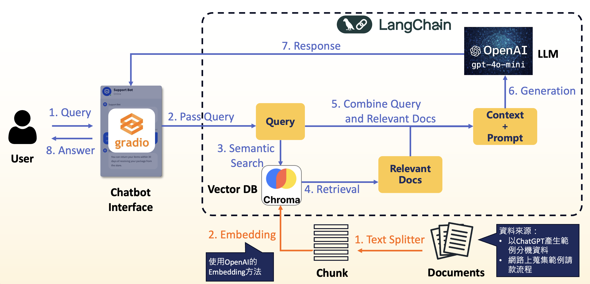

# LangChainRAG
In this project, I have created a simple internal company system Chatbot as a proof of concept (POC) using Retrieval-Augmented Generation (RAG). The system incorporates internal company data to build a knowledge base, enabling users to retrieve information through conversation. The retrieved information is then generated into readable text using a Large Language Model (LLM). Please refer to the flow diagram below:

Tech Stack：
- LLM: ChatGPT-4o-mini
- Langchain
- Vector DB: ChromaDB
- Embedding: openAI Embedding

## Step 1: Create Virtual Environment
`python3 -m virtualenv {env_name}`

## Step 2: Activate Virtual Environment
`source {env_name}/bin/activate`

## Step 3: Install Python Packages
`pip install -r requirements.txt`

## Step 4:Prepare Environment Variables
1. Copy `.env.example` to `.env`
2. Modify `.env` with your specificconfigurations

## Step 5: Run the Program
Open `rag.ipynb` and execute each cell

## Step6: Deactivate Virtual Environment
`source deactivate`

